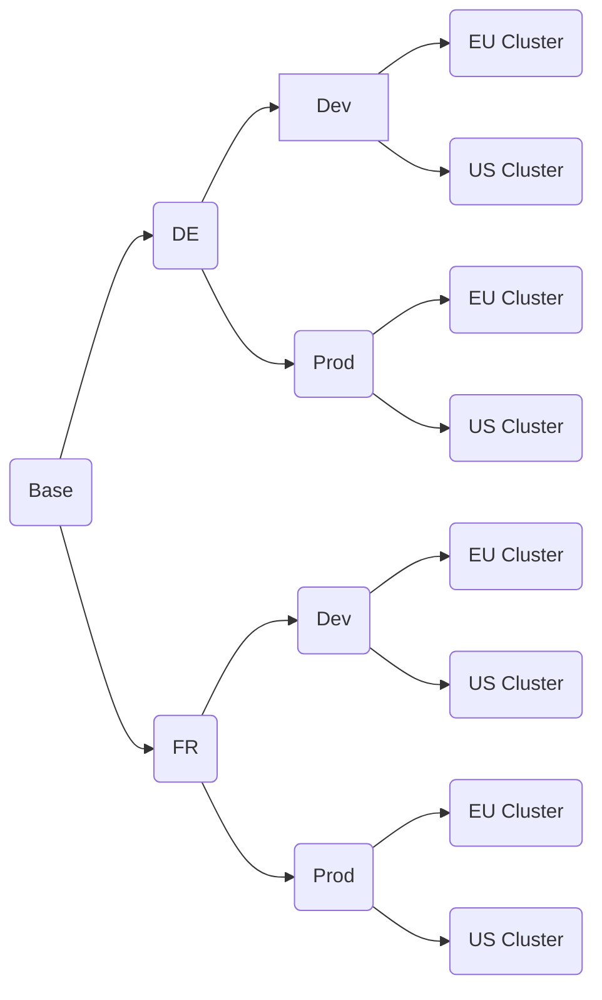

**There are lots of blog posts about kustomize, a tool for parametrizing a kubernetes deployment. They show how with this great tool you can adapt a set of kubernetes manifests to your needs. Yet, many of these posts and also the official documentation focus mainly on simple cases. This post will show how also more complicated settings can be handled, where multiple variations of the same base configuration need to be deployed together**

### What is kustomize
[kustomize](https://kustomize.io/) is a tool to adapt predefined kubernetes manifests to the needs of a deployment. Unlike the well-established tool [helm](https://helm.sh/) it doesn't use a template language for this, but instead it uses a diff-based approach. A base configuration is overriden where necessary by rules which are defined in so called "overlays". With this approach simple configuration changes can be done so easily that kustomize has become the built-in standard in kubernetes for this kind of job. Since the tool has been [announced by Google in 2018](https://kubernetes.io/blog/2018/05/29/introducing-kustomize-template-free-configuration-customization-for-kubernetes/) it has quickly become the new go-to option where helm seems to be too complicated. Since kubernetes 1.14 in early 2019 the kustomize functionality is even built into the kubectl command line tool. So no additional setup is necessary once you have the kubectl client up and running.

Let's give a quick example of how the tool works. Let's say we have a simple web service which we need to adapt to our needs. Then we might have base manifests as follows:

```
```


### Target Configuration Structure
Multiple dimensions:
- environment (dev/test/prod):
    Different sizing, additional ingress routes
- target cluster (eu/us):
    Ingress routes
    Sizing
- application variant (per country for example with a separate db backend?):
    Database backend
    base path


Exponential growth of configurations


```
├───base                            Common base configuration for an api application
|   |                                (deployment, autoscaler, services, but no routes)
│   ├───per-country                Country specific parts
│   └───per-country-language       Country and language specific parts
|
├───routes                          Openshift routes
│   ├───per-country                
│   │   ├───base
│   │   ├───gtm
│   │   └───ltm
│   └───per-country-language
│       ├───base
│       ├───gtm
│       └───ltm
|
├───workloads                       Compilation of deployable units
|   |                               Each one is based on /base and /routes
│   ├───au-en
│   │   ├───per-country
│   │   └───per-country-language
│   ├───cr-es
│   │   ├───per-country
│   │   └───per-country-language
│   ├───us-en
│   │   ├───per-country
│   │   └───per-country-language
│   └───in-en
│       ├───per-country
│       └───per-country-language
│
└───deployments                     Deployment configurations based on /workloads
    |                               Each one assigns multiple workloads to a target environment
    └───dev-us
```

### Implementation

### Summary

The code is available on github...
