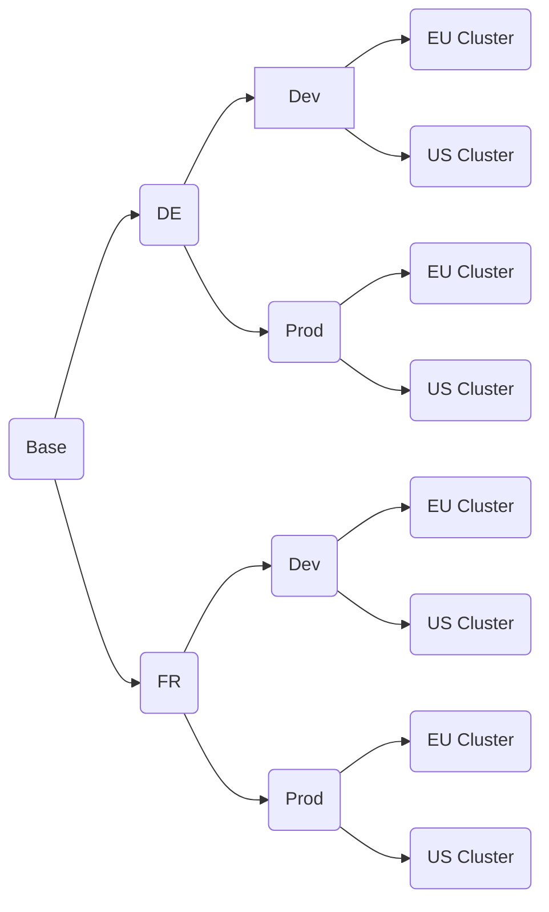

## Composing a complex kubernetes configuration with kustomize

### What is kustomize

### Target Configuration Structure
Multiple dimensions:
- environment (dev/test/prod):
    Different sizing, additional ingress routes
- target cluster (eu/us):
    Ingress routes
    Sizing
- application variant (per country for example with a separate db backend?):
    Database backend
    base path

Exponential growth of configurations

### Implementation

### Summary

The code is available on github...
