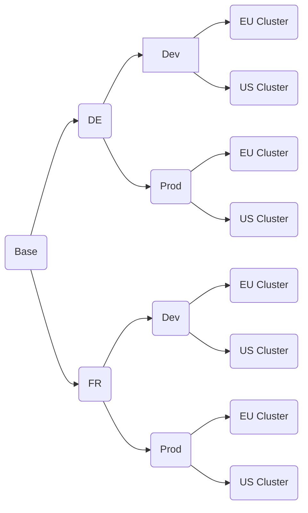

## Composing a complex kubernetes configuration with kustomize

### What is kustomize

### Target Configuration Structure
Multiple dimensions:
- environment (dev/test/prod):
    Different sizing, additional ingress routes
- target cluster (eu/us):
    Ingress routes
    Sizing
- application variant (per country for example with a separate db backend?):
    Database backend
    base path


Exponential growth of configurations


```
├───base                            Common base configuration for an api application
|   |                                (deployment, autoscaler, services, but no routes)
│   ├───per-country                Country specific parts
│   └───per-country-language       Country and language specific parts
|
├───routes                          Openshift routes
│   ├───per-country                
│   │   ├───base
│   │   ├───gtm
│   │   └───ltm
│   └───per-country-language
│       ├───base
│       ├───gtm
│       └───ltm
|
├───workloads                       Compilation of deployable units
|   |                               Each one is based on /base and /routes
│   ├───au-en
│   │   ├───per-country
│   │   └───per-country-language
│   ├───cr-es
│   │   ├───per-country
│   │   └───per-country-language
│   ├───us-en
│   │   ├───per-country
│   │   └───per-country-language
│   └───in-en
│       ├───per-country
│       └───per-country-language
│
└───deployments                     Deployment configurations based on /workloads
    |                               Each one assigns multiple workloads to a target environment
    └───dev-us
```

### Implementation

### Summary

The code is available on github...
