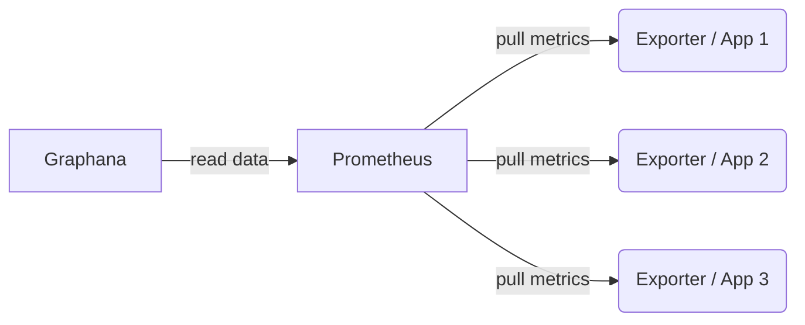

**[Prometheus](https://prometheus.io/) is a popular choice for monitoring applications. It is easy to set up and can be deployed alongside the applications inside a Kubernetes cluster. However, when you cannot run your main Prometheus instance within the same cluster it becomes a bit more tricky. On the job we recently set up Prometheus monitoring for an API which is deployed to independent kubernetes clusters in different regions. In this post I will show how to combine the metrics of applications running in separate Kubernetes clusters.**

In contrast to other monitoring systems, Prometheus follows a pull workflow. The monitoring targets have to expose their metrics on an HTTP endpoint where Prometheus can "scrape" the data at its own pace. This is typically done by modules called ["exporters"](https://prometheus.io/docs/instrumenting/exporters/), e.g. the node exporter for system metrics. So including a visualization tool [Grafana](https://grafana.com/) which is often used to create dashboards the setup looks like this:



The exporters simply expose the metrics as an HTTP endpoint, say `/metrics`. The data looks for example like this: 
```
http_requests_total{method="get",code="400"}  3   1395076383000
http_requests_total{method="get",code="200"}  1555   1395076383000
http_requests_total{method="get",code="500"}  0   1395076383000
```
In this example one would see how many requests were served up to the time demarked by the timestamp `1395076383000`. These were 1555 HTTP Get requests answered with status code 200, three answered with 400 and none which resulted into a server error with code 500.

This is how Prometheus could be configured to scrape from such an endpoint:
```yaml
global:
  scrape_interval: 15s
  scrape_timeout: 15s
  evaluation_interval: 15s
scrape_configs:
- job_name: mlapi
  honor_labels: true
  honor_timestamps: true
  scrape_interval: 15s
  scrape_timeout: 15s
  metrics_path: /metrics
  scheme: https
  static_configs:
  - targets:
    - mlapi.xyz
    labels:
      env: prod
      location: us
```


## Monitoring a Kubernetes deployment
For an application hosted as a "deployment" object on Kubernetes the approach of exposing the metric as HTTP endpoint and letting Prometheus scrape it, still works. However, one needs to take care to point Prometheus to the endpoint in every Kubernetes pod and not to access it via an ingress route and service object, i.e. not via the outward facing url as in the first example above. This is because it might be that multiple replicas of the pod exist, e.g. an old and a new version during a rolling update. Every pod would only serve some of the requests and with every scraping action Prometheus would get routed to a different pod. Everytime it would see the metrics of another one of the replicas and the numbers would be inconsitent and unusable.

To avoid this problem, Prometheus provides service discovery functionality for Kubernetes, the [kubernetes_sd_config module](https://prometheus.io/docs/prometheus/latest/configuration/configuration/#kubernetes_sd_config). This module accesses the Kubernetes API to discover the pod objects and their IP addresses. Because these IP addresses are only reachable inside the Kubernetes cluster, Prometheus also needs to be run inside the cluster for this.

The following listing shows a configuration for Prometheus which scrapes the `/metrics` endpoint of all pods with a certain label (`application=mlapi`) in the namespace `mlapi-prod`. The name of the pod is added as additional label. Also it is necessary to limit the discovery to certain network ports, because otherwise one scraping target per pod and port is generated:
```yaml
global:
  scrape_interval: 15s # By default, scrape targets every 15 seconds.
  evaluation_interval: 15s # By default, scrape targets every 15 seconds.
  scrape_timeout: 10s

scrape_configs:
  - job_name: 'mlapi-pods'

    kubernetes_sd_configs:
    - role: pod
      namespaces:
        names:
        - mlapi-prod
      selectors:
        - label: "application=mlapi"
          role: pod

    metrics_path: /metrics

    relabel_configs:
    - source_labels: [__meta_kubernetes_pod_container_port_number]
      regex: '9443'
      action: drop
    - action: labelmap
      regex: __meta_kubernetes_pod_label_(.+)
    - source_labels: [__meta_kubernetes_namespace]
      action: replace
      target_label: kubernetes_namespace
    - source_labels: [__meta_kubernetes_pod_name]
      action: replace
      target_label: kubernetes_pod_name
```

```yaml
---
apiVersion: apps/v1
kind: Deployment
metadata:
  labels:
    cluster: us
    environment: prod
  name: prometheus
  namespace: mlapi-prod
spec:
  replicas: 1
  selector:
    matchLabels:
      cluster: us
      environment: prod
      module: monitoring
  template:
    metadata:
      labels:
        app: prometheus
        cluster: us
        environment: prod
        module: monitoring
    spec:
      containers:
      - image: prom/prometheus:v2.24.0
        initialDelaySeconds: 15
        livenessProbe:
          httpGet:
            path: /-/healthy
            port: 9090
        name: prometheus
        periodSeconds: 20
        ports:
        - containerPort: 9090
          name: default
        readinessProbe:
          httpGet:
            path: /-/ready
            port: 9090
          initialDelaySeconds: 5
          periodSeconds: 10
        resources:
          limits:
            cpu: 100m
            memory: 200Mi
          requests:
            cpu: 10m
            memory: 50Mi
        volumeMounts:
        - mountPath: /etc/prometheus/
          name: config-volume
        - mountPath: /prometheus
          name: prometheus-volume
      serviceAccount: prometheus
      serviceAccountName: prometheus
      volumes:
      - configMap:
          name: prometheus-config
        name: config-volume
      - emptyDir: {}
        name: prometheus-volume
---
apiVersion: v1
kind: Service
metadata:
  labels:
    app: prometheus
    cluster: us
    environment: prod
    module: monitoring
  name: prometheus-svc
  namespace: mlapi-prod
spec:
  ports:
  - port: 80
    protocol: TCP
    targetPort: 9090
  selector:
    app: prometheus
    cluster: us
    environment: prod
    module: monitoring
---
apiVersion: route.openshift.io/v1
kind: Ingress
metadata:
  labels:
    app: prometheus
    cluster: us
    environment: prod
    module: monitoring
  name: prometheus
  namespace: mlapi-prod
spec:
  host: monitoring.myapp.xyz
  path: /federate
  tls:
    termination: edge
  to:
    kind: Service
    name: prometheus-svc
    port: 80
    weight: 100
  wildcardPolicy: None
```


Central configuration:
```yaml
Configuration

global:
  scrape_interval: 25s
  scrape_timeout: 15s
  evaluation_interval: 15s
scrape_configs:
- job_name: mlapi-federate
  honor_labels: true
  honor_timestamps: true
  params:
    match[]:
    - '{job!=""}'
    - '{__name__=~"job:.*"}'
  scrape_interval: 15s
  scrape_timeout: 15s
  metrics_path: /federate
  scheme: https
  static_configs:
  - targets:
    - prometheus1.cluster1.xyz
    labels:
      env: prod
      location: us
```